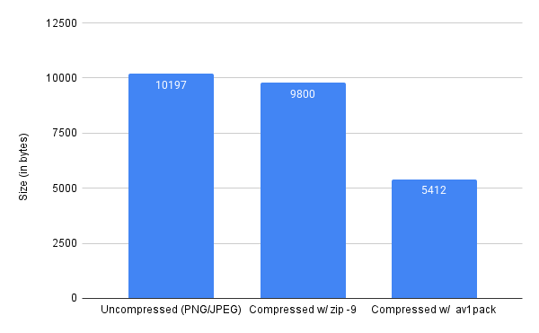

# av1pack: Visually lossless image album compression w/ H264
Fundamentally what this project does, it "packs" your album (folder) of images into a h264 video for better compression applied over every image's similar features, This allows for better compression than simply archiving the images w/ zip or 7z, And the resulting H264 video can even be _eventually_ even used as an instant slideshow

## Working


## Features
- NVENC HW accelerated encoding support (via ffmpeg)
- Supporting metadata is also encoded and not lost during packing
- **WIP** Support for images containing alpha
- **WIP** EXIF & other metadata also stored with images

## Graphs
Not a great benchmark but compressing the `gov_small` dataset, makes it about 50% smaller



> **Warning**: The output file size can vary a lot depending on the images and the settings used so its not always better and can sometimes even be worse compared to zip archive, Also encoder settings work differently from encoder to encoder so best consult the ffmpeg docs as you go

## Installation
Currently the software is a WIP so to use it, you need
- FFmpeg 
- *tqdm
- *PIL (Pillow)

*- they are python modules so you can `pip install` them into a venv or use `uv`

## Usage
Mainly consists of 2 operations, packing (putting into a video file) & unpacking (turning back into frames)

### Packing
```
python3 pack.py ./PATH_TO_DIRECTORY_WITH_IMAGES
```
You have the following knobs to control, `qp`, `preset` & `crf`, Read about their usage in encoding in the [ffmpeg documentation](https://trac.ffmpeg.org/wiki/Encode/H.264)

### Unpacking
```
python3 unpack.py ./OUTPUT.mkv ./DIRECTORY_TO_OUTPUT_FRAMES_INTO
```

## TODO
- GUI w/ tkinter
- Modifiable video parameters for more _slideshow_ ahh output
- Rename since I didn't end up actually using AV1
- ! Normalize Colorspace
- ! test against larger & more varied dataset
- ! Find a sweetspot of compression settings (ideally more towards lossless)
- ! more comparison charts

## Acknowledgements
- This project heavily relies on the incredible capabilities of [FFmpeg](https://ffmpeg.org/) for video encoding and decoding.
- Special thanks to the [Pillow (PIL)](https://python-pillow.org/) library for providing powerful image processing tools.